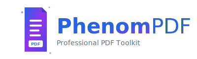

# PhenomPDF

A professional web application that allows users to upload multiple PDF files via drag-and-drop, merge them in any order, and download the merged result.



## Tech Stack

- **Frontend:** React + Vite + Tailwind CSS
- **Backend:** FastAPI (Python)

## Project Structure

```
pdf/
├── frontend/       # React frontend application
│   ├── public/      # Static assets (logos, favicon)
│   ├── src/
│   │   ├── components/  # Reusable React components
│   │   └── pages/      # Page components
│   └── package.json
└── backend/        # FastAPI backend application
```

## Brand Assets

PhenomPDF includes a comprehensive set of logo assets:

- **Logo Variants**: Horizontal, square, and icon versions in SVG format
- **React Component**: `<Logo />` component for easy integration
- **Favicon**: Browser-ready favicon matching the brand

See [LOGO_SHOWCASE.md](LOGO_SHOWCASE.md) for detailed logo specifications and usage guidelines.

## Getting Started

### Prerequisites

- Node.js 18+
- Python 3.10+

### Backend Setup

1. Navigate to the backend directory:
   ```bash
   cd backend
   ```

2. Create a virtual environment (optional but recommended):
   ```bash
   python -m venv venv
   source venv/bin/activate  # On Windows: venv\Scripts\activate
   ```

3. Install dependencies:
   ```bash
   pip install -r requirements.txt
   ```

4. Start the backend server:
   ```bash
   uvicorn main:app --reload
   ```

   The backend will run at http://localhost:8000

### Frontend Setup

1. Navigate to the frontend directory:
   ```bash
   cd frontend
   ```

2. Install dependencies:
   ```bash
   npm install
   ```

3. Start the development server:
   ```bash
   npm run dev
   ```

   The frontend will run at http://localhost:5173

## Usage

1. Open http://localhost:5173 in your browser
2. Drag and drop PDF files onto the drop zone (or click to browse)
3. Use the up/down arrows to reorder files
4. Click "Merge PDFs" to combine all files
5. The merged PDF will automatically download

## API Endpoints

- `GET /health` - Health check endpoint
- `POST /merge` - Merge multiple PDF files
  - Accepts: Form data with multiple PDF files
  - Returns: Merged PDF file
- `POST /reorder` - Reorder PDF pages
  - Accepts: Form data with PDF file and page_order (JSON array of page numbers, 1-indexed)
  - Returns: Reordered PDF file
